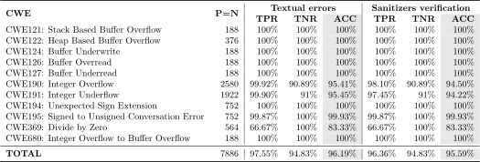

# Juliet C/C++ Dynamic Test Suite

This repository contains [Juliet](https://samate.nist.gov/SRD/testsuite.php)
C/C++ test suite for dynamic tools. You can measure True Positive and True
Negative rates for your dynamic tool. This repository was used to measure
results for "Symbolic Security Predicates: Hunt Program Weaknesses"
[paper](https://arxiv.org/abs/2111.05770). However, feel free to support your
own tool.

## Dependencies

    $ sudo apt install clang-10 gcc-multilib

## Build

Building all CWEs may require a long time. Building required CWE to measure
Sydr:

    $ CC=clang-10 CXX=clang++-10 make -j15 CWE121 CWE122 CWE124 CWE126 CWE127 CWE190 CWE191 CWE194 CWE195 CWE369 CWE680

## Usage

    usage: test_juliet.py [-h]
                          [-c [CWE_NUM_1 CWE_NUM_2 ... [CWE_NUM_1 CWE_NUM_2 ... ...]]]
                          [-t TOOL] [-e] [-d] [-r] [-j THREADS]

    optional arguments:
      -h, --help            show this help message and exit
      -c [CWE_NUM_1 CWE_NUM_2 ... [CWE_NUM_1 CWE_NUM_2 ... ...]], --cwe [CWE_NUM_1 CWE_NUM_2 ... [CWE_NUM_1 CWE_NUM_2 ... ...]]
                            Run specified CWE.
      -t TOOL, --tool TOOL  Tool name.
      -e, --error           Print false positive and false negative tests.
      -d, --delete          Delete results and collect them again.
      -r, --reproduce       Recalculate statistics and reproduce sanitizers
                            verification.
      -j THREADS            Set number of threads.

## Run Juliet

You can measure TPR and TNR for your tool via `test_juliet.py` script, which
does the following:

1. The script runs your tool on all Juliet test cases.
2. Each test case is executed on a valid input that does not lead to an error.
3. Your tool should generate new inputs that may trigger an error.
4. The script assigns TP to positive test case if at least one input was
   generated. The script assigns FP to negative test case if at least one input
   was generated. The script assigns TN to negative test case if no inputs were
   generated. The script assigns FN to positive test case if no inputs were
   generated.
5. Afterwards, the script verifies TP cases on sanitizers. TP stays for test
   case if sanitizers signal an error for at least one generated input, FN is
   assigned to the test case otherwise.

The following script runs Sydr on all Juliet test cases, determines classes (TP,
FP, TN, FN) for each test case, and verifies generated inputs on sanitizers:

    $ ./test_juliet.py -j4

The script will generate `results/stats.json` file containing classes (TP, FP,
TN, FN) and sanitizers verification result for each checked Juliet test case.

Moreover, script prints overall TPR, TNR, and
[ACC](https://en.wikipedia.org/wiki/Sensitivity_and_specificity) before/after
sanitizers verification.

The sequential runs of `test_juliet.py` will only print the already obtained
statistics.

The following command prints all False Positive and False Negative cases:

    $ ./test_juliet.py -e

## Generating LaTex Table

Save statistics to file (results must be already collected):

    $ ./test_juliet.py > stats.txt

Generate LaTex file:

    $ ./table.py > stats.tex

Building pdf:

    $ pdflatex stats.tex

Generating svg:

    $ pdf2svg stats.pdf stats.svg

## Reproducing Statistics

If you do not acquire Sydr, you can reproduce statistics from raw results:

1. Extract results archive in Juliet root:
```
$ tar xf results.tar.xz
```
2. The following script will remove `results/stats.json` and rerun sanitizers
   verification:
```
$ ./test_juliet.py --reproduce -j4
```

If you want to generate LaTex table, see section above.

## Supporting Your Dynamic Tool

You just need to implement `run_TOOLNAME` function in `test_juliet.py`. This
function accepts path to a single Juliet test case binary, CWE enum for the test
case, and path to corresponding input file containing stdin. The function should
return list of new generated inputs by your tool. Then just run:

    $ ./test_juliet.py -j4 -t TOOLNAME

## Sydr Evaluation

We evaluated Sydr security predicates on Juliet test suite. See results below:



## Cite Us

```
@article{vishnyakov21,
  title = {Symbolic Security Predicates: Hunt Program Weaknesses},
  author = {Vishnyakov, Alexey and Logunova, Vlada and Kobrin, Eli and Kuts,
            Daniil and Parygina, Darya and Fedotov, Andrey},
  booktitle = {2021 Ivannikov ISPRAS Open Conference (ISPRAS)},
  year = {2021},
  publisher = {IEEE},
  url = {https://arxiv.org/abs/2111.05770},
}
```
